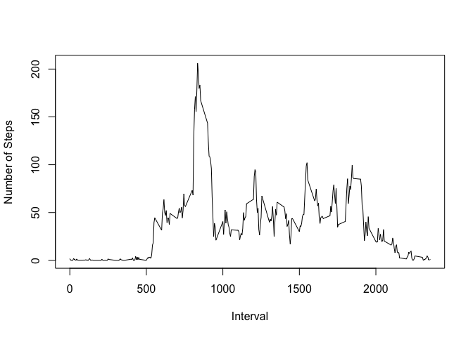

# Reproducible Research: Peer Assessment 1


## Loading and preprocessing the data
Load library dplyr and lubridate.  
Unzip the data file and read data into dataframe amd.  

```r
library(dplyr)
```

```
## 
## Attaching package: 'dplyr'
## 
## The following objects are masked from 'package:stats':
## 
##     filter, lag
## 
## The following objects are masked from 'package:base':
## 
##     intersect, setdiff, setequal, union
```

```r
library(lubridate)
library(lattice)
unzip("./activity.zip",exdir = "../")
amd <- read.csv("../activity.csv",
                colClasses = c("integer","factor","integer"))
```


## What is mean total number of steps taken per day?
1. To calculate mean steps of each day, dataset was split by date and the total number of steps per day was calculated by sum function with NA removed.  

```r
steps_day <- sapply(split(amd$steps,amd$date), sum,na.rm=TRUE)
```
2. Make a histogram of the mean of the total number of steps taken per day.  

```r
hist(steps_day)
```

 
  
3. Claculate and report the mean and median of the total number of steps taken per day

```r
mean(steps_day,na.rm = TRUE)
```

```
## [1] 9354.23
```

```r
quantile(steps_day,na.rm = TRUE,probs = c(0.5))
```

```
##   50% 
## 10395
```

## What is the average daily activity pattern?
Calculate the average number of steps taken, averaged across all days.  
Result was store in a new dataframe ms_interval with two variables msi and interval.  

```r
split(amd$steps,as.factor(amd$interval)) %>% sapply(mean,na.rm=TRUE) -> mean_steps_interval
ms_interval <- data.frame(msi=mean_steps_interval,interval= as.numeric(names(mean_steps_interval)))
```
Make a time series plot of 5-minute interval and the average number of steps taken.  

```r
plot(ms_interval$interval,ms_interval$msi,type = 'l',xlab = "Interval",ylab = "Number of Steps")
```

 
  
In order to show which 5-minute interval containing the maximum number of steps, the greatest averaged number of steps in ms_interval was found by max() function.  
And then show the coresponding interval.  

```r
ms_interval$interval[ms_interval$msi==max(ms_interval$msi)]
```

```
## [1] 835
```

## Imputing missing values
1. Calculate and report the total number of missing values in the dataset.  

```r
sum(is.na(amd))
```

```
## [1] 2304
```
2. Filling all of the missing value in the dataset by mean of that 5-minute interval. First calculate the mean of that 5-minute base on the average number of steps taken averaged across all the days.  

```r
nafill <- mean(ms_interval$msi,na.rm = TRUE)
```
3. Second create a new dataset equal to the original dataset but with the missing value data filled in.  

```r
amdnew <- within(amd,{steps[is.na(steps[])] <- nafill})
```
4. Calculate and make a histogram of the total number of steps taken each day.  

```r
steps_day <- sapply(split(amdnew$steps,amdnew$date),sum)
hist(steps_day,xlab = "Total number of steps taken per day")
```

 
  
Report the mean and median steps taken per day.  

```r
mean(steps_day)
```

```
## [1] 10766.19
```

```r
quantile(steps_day,probs = c(0.5))
```

```
##      50% 
## 10766.19
```
Before NAs were filled with mean of that 5-minute interval, the average number of total steps taken per day is 9354.23 and the median is 10395, when NAs were filled, the mean and median both change to 10766.19. And steps taken per day seem like normal distribution.  

## Are there differences in activity patterns between weekdays and weekends?
1. Create a new factor variable in the dataset with two levels -- "weekday" and "weekend" indicating whether a given date is a weekday or weekend day.  

```r
amdnew <- within(amdnew,{wd <- NA
wd[weekdays(ymd(date),abbreviate=TRUE)!="七" | weekdays(ymd(date),abbreviate=TRUE)!="六"] <- "weekday"
wd[weekdays(ymd(date),abbreviate=TRUE)=="七" | weekdays(ymd(date),abbreviate=TRUE)=="六"] <- "weekend"})
```
2. Make a panel plot containing a time series plot (type = "l") of the 5-minute interval (x-axis) and the average number of steps taken, averaged across all weekday days or weekend days (y-axis).  
First I split the dataset by weekday.  

```r
amdnew_wd <- split(amdnew,amdnew$wd)
```
Second calculate mean steps of the 5-minute interval.  

```r
msi_wd <- sapply(amdnew_wd,function(x){sapply(split(x$steps,as.factor(x$interval)),mean) })
msi_wd <- as.data.frame(msi_wd)
```
Change matrix msi_wd to tidy dataframe.  

```r
df_msi_wd <- rbind(data.frame(interval=rownames(msi_wd),
                        msi= msi_wd$weekday[],
                        wd='weekday'),
                   data.frame(interval=rownames(msi_wd),
                        msi= msi_wd$weekend[],
                        wd='weekend'))
df_msi_wd$interval <- as.integer(as.character(df_msi_wd$interval))
df_msi_wd$msi <- as.numeric(df_msi_wd$msi)
df_msi_wd$wd <- as.factor(df_msi_wd$wd)
```
Make a panel plot.  

```r
xyplot(msi ~ interval|wd, data = df_msi_wd, type= 'l', layout= c(1,2), xlab = 'Interval', ylab = 'Number of steps')
```

 
